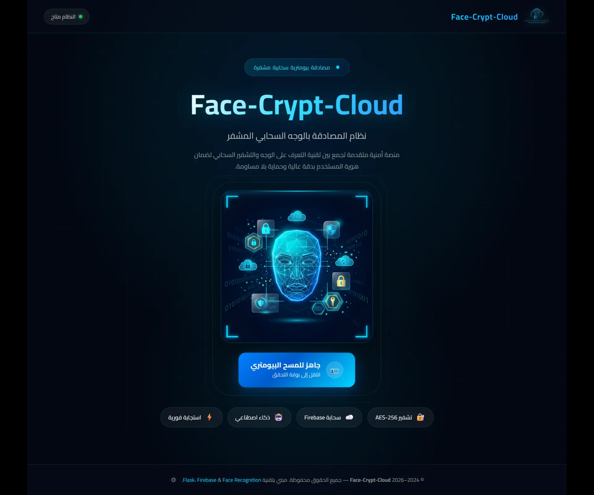
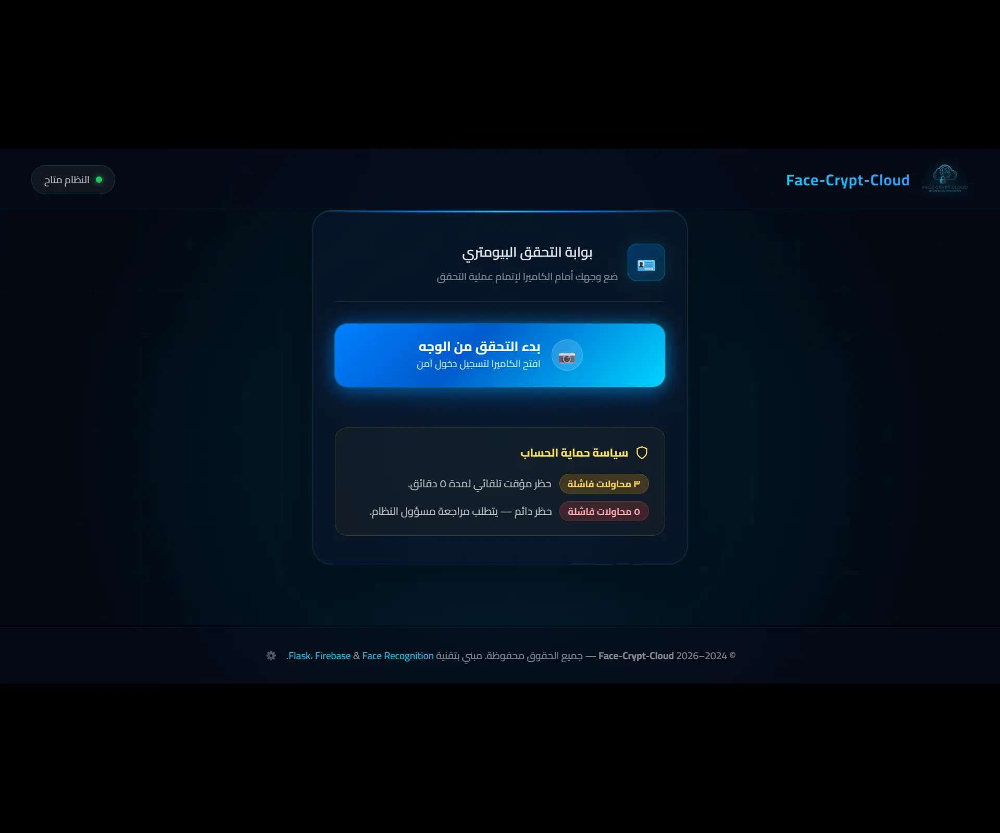
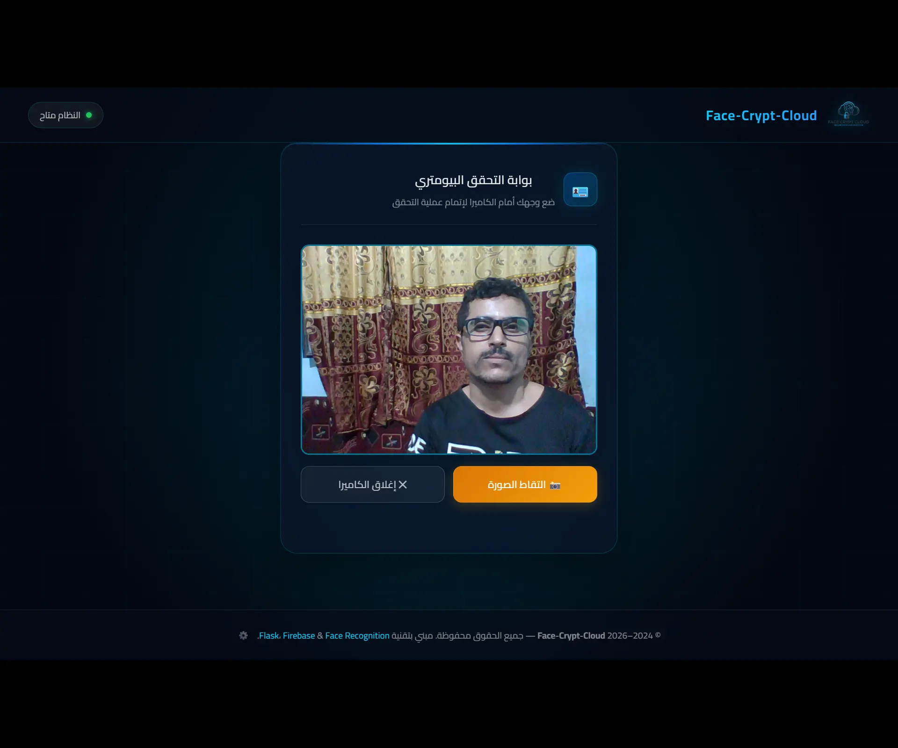
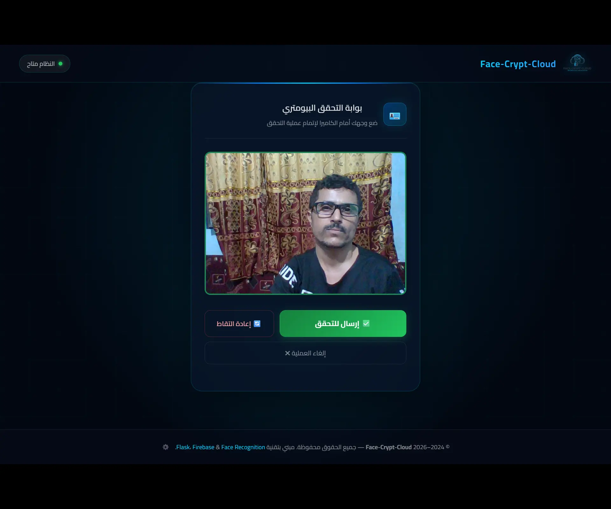
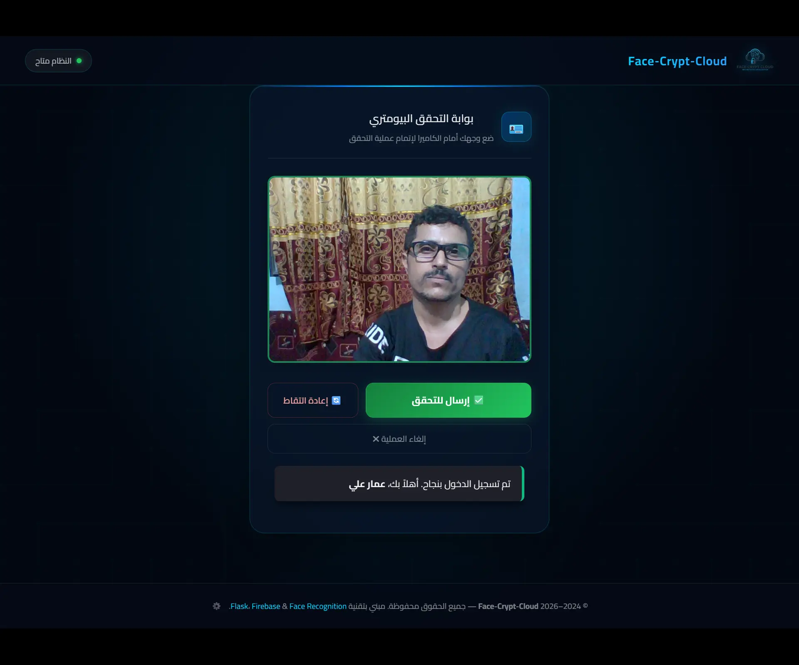
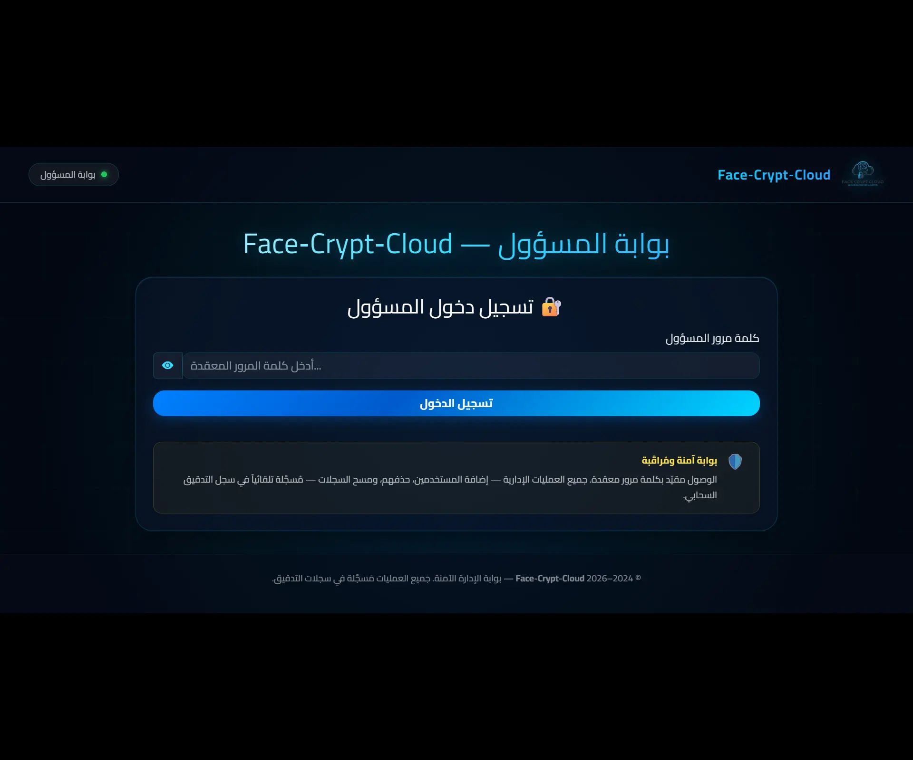
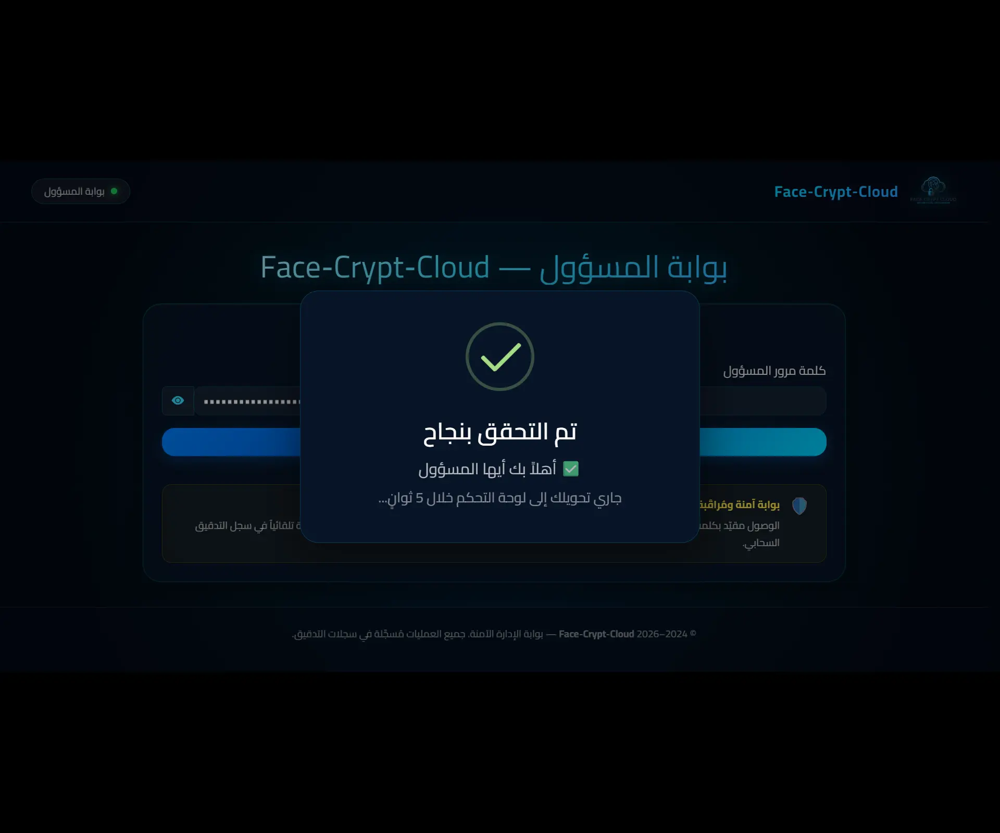

<div align="center">

# ☁️ Face Crypt Cloud

### A cloud-based, passwordless biometric authentication system — powered by AI, secured by cryptography.

[](https://face-crypt-cloud-184918603595.us-central1.run.app/)
[](https://www.python.org/)
[](https://flask.palletsprojects.com/)
[](https://www.docker.com/)
[](https://firebase.google.com/)
[]()
[](LICENSE)
[]()

**🔗 Try it live:** [face-crypt-cloud-184918603595.us-central1.run.app](https://face-crypt-cloud-184918603595.us-central1.run.app/)

</div>

---

## 📖 About the Project

**Face Crypt Cloud** is a senior engineering capstone project that eliminates the security vulnerabilities inherent in traditional passwords — phishing, brute-force attacks, and cross-site credential reuse.

The system works by capturing a live image of the user via webcam, extracting precise biometric face encodings using `dlib`, and **encrypting those encodings** with the `Fernet` algorithm (AES-128 + HMAC-SHA256) before storing them in Google Firebase. During login, matching is performed entirely in server memory — **no passwords, no raw face images stored** — only an encrypted numerical representation of the user's biometric signature.

---

## ✨ Key Features

* 🔐 **Passwordless Biometric Auth:** Fast, secure login via facial recognition using `dlib` / `face_recognition`. No password required at any point.
* 🔑 **WebAuthn / Passkey Support:** Optional FIDO2 hardware-backed passkey registration after a successful face verification. Serves as a convenience layer, not a standalone replacement for the initial face enrollment.
* 🕵️ **Multi-Layer Liveness Detection:** Detects static printed photos via Laplacian blur analysis, performs real-time geometric challenge validation (MediaPipe in-browser), and runs AI-based spoof detection (MiniFASNetV2 ONNX — ~2.7ms per inference on CPU).
* 🛡️ **Biometric Data Encryption:** Face encodings are **never stored in plaintext**. Encrypted with `cryptography.Fernet` (AES-128-CBC + HMAC-SHA256) before being persisted to Firestore.
* 🚦 **Rate Limiting & Account Lockout:** Automatic 5-minute soft-block after 3 consecutive failures and permanent admin-mediated block after 5. Rate-limited login endpoint: 10 requests/min and 30 requests/hour per IP via `Flask-Limiter`.
* 🕶️ **Anti-Enumeration:** All login failure states (wrong face, blocked, soft-blocked) return identical HTTP 403 responses, preventing attackers from inferring account existence or status.
* ⏱️ **Timing-Attack Resistance:** All password and CSRF token comparisons use `hmac.compare_digest` for constant-time evaluation.
* 📊 **Admin Dashboard:** Real-time user management, aggregation-query-based statistics (no full collection scans), and paginated audit logs.
* 📝 **Comprehensive Audit Trail:** Every authentication event (success, failure, block) is logged to Firestore with timestamp, user ID, and source IP.
* 🌍 **Bilingual Support (AR/EN):** Full English and Arabic localization across all templates, custom alerts, JavaScript popups, and backend API responses. The interface utilizes modern CSS logical properties (`margin-inline-start`, etc.) to natively adapt and mirror layouts seamlessly between LTR and RTL reading directions.
* 🎨 **Modern UI:** Custom "Dark Glassmorphism" design system built with Vanilla CSS3, fully responsive, and respects `prefers-reduced-motion` for accessibility.

---

## 📸 System Interface Tour

### 1. Main System Portal

A modern dark landing page showcasing the core technologies (AES-128 encryption, AI, and cloud infrastructure), featuring a live server health indicator and a clear call-to-action to the security verification gateway.



### 2. Security & Verification Gateway
The biometric authentication entry point. Displays the account protection policy (temporary and permanent lockout rules) upfront to deter unauthorized access attempts before the webcam is activated.



### 3. Live Face Capture Window
An interactive environment that seamlessly integrates a live webcam feed with the web interface, featuring a real-time MediaPipe Face Mesh overlay. Provides clear controls for the user to ensure capture quality before processing.



### 4. Frame Evaluation & Submission Window
A visual confirmation step that gives the user full control over their input — with options to retake if lighting is poor or submit immediately to the cloud server to initiate the secure matching algorithms.



### 5. Security Clearance & Welcome Screen
The successful culmination of the authentication flow. A popup modal confirms biometric match and welcomes the user by name, reflecting the speed and accuracy of the underlying AI algorithms.



### 6. Monitored Administrative Access Gateway
The security wall protecting the admin panel. Requires a strong admin password and displays an explicit notice that all administrative operations are automatically logged to the cloud audit trail.



### 7. Admin Gateway Clearance Modal
A smooth, trustworthy transition modal upon successful admin login, featuring a transparent countdown before auto-redirecting to the full-privilege admin dashboard.



---

## 🛠️ Technology Stack

| Category | Technologies |
|---|---|
| **Backend** | Python 3.10+, Flask 3.1, Waitress (production WSGI server) |
| **AI & Image Processing** | `face_recognition`, `dlib`, `opencv-python-headless`, `onnxruntime` (MiniFASNetV2 — Apache 2.0), `Pillow`, `NumPy` |
| **Frontend Client-Side AI** | MediaPipe Tasks Vision (CDN) — real-time Face Mesh, Blendshapes for active liveness challenges |
| **Database & Cloud** | Google Firebase (Cloud Firestore & Cloud Storage) |
| **Security** | `cryptography` (Fernet), `Flask-Limiter`, `hmac.compare_digest`, Custom CSRF tokens, WebAuthn (`py_webauthn` / Duo Labs) |
| **Containerization & Deployment** | Docker (multi-stage build), Docker Compose, Google Cloud Run |
| **Frontend** | HTML5, Vanilla CSS3 (custom design system), Vanilla JavaScript, SweetAlert2 |
| **Testing** | `pytest` — 26 tests covering auth flows, liveness, anti-enumeration, XSS protection, session authorization, audit log pagination, and WebAuthn registration |

---

## 🚀 Getting Started

### ✅ Recommended: Docker (Fastest & Most Reliable)

No need to install `cmake`, a C++ compiler, or any native build tools manually — everything is handled inside the container.

```bash
git clone https://github.com/Ammar-1993/Face-Crypt-Cloud-Arabic.git
cd Face-Crypt-Cloud-Arabic

# Copy the environment template and fill in your values
cp .env.example .env

# Place your Firebase service account key at the path defined in .env
# Default: firebase/serviceAccountKey.json

docker compose build          # First build compiles dlib — takes a few minutes, normal
docker compose up -d

# Verify everything is working
curl http://localhost:8081/health
docker compose exec app pytest -v   # Expected: 26 passed
```

Open **`http://localhost:8081`** in your browser.

> For a detailed WSL2-specific setup guide, including local HTTPS configuration for testing the admin panel, see [`WSL2_DOCKER_SETUP.md`](./WSL2_DOCKER_SETUP.md).

---

### 🐍 Alternative: Local Virtual Environment

Requires `cmake` and a C++ compiler pre-installed on your system (needed to compile `dlib`).

```bash
git clone https://github.com/Ammar-1993/Face-Crypt-Cloud-Arabic.git
cd Face-Crypt-Cloud-Arabic

python -m venv venv
source venv/bin/activate          # Windows: venv\Scripts\activate

pip install -r requirements.txt
cp .env.example .env              # Fill in values; place serviceAccountKey.json at its path
```

**Development server** (with auto-reload when `FLASK_DEBUG=True`):
```bash
python app.py
```

**Production-like local server:**
```bash
waitress-serve --host=0.0.0.0 --port=8080 wsgi:app
```

| Endpoint | URL |
|---|---|
| User verification portal | `http://127.0.0.1:8081/verify` |
| Admin dashboard | `http://127.0.0.1:8081/admin/` |

---

## ⚙️ Environment Variables

Copy `.env.example` to `.env` and populate each value. The variable names are **identical** to what `app/config.py` reads at startup:

```env
# Biometric data encryption key — generate with Fernet
FACECRYPT_SECRET_KEY=your_generated_fernet_key_here

# Flask session & CSRF token secret — must differ from the Fernet key
FACECRYPT_FLASK_SECRET_KEY=your_generated_flask_secret_key_here

# Admin panel password — verified in constant-time via hmac.compare_digest
FACECRYPT_ADMIN_PASSWORD=YourStrongAdminPassword

# Firebase credentials
FACECRYPT_SERVICE_ACCOUNT_PATH=firebase/serviceAccountKey.json
FACECRYPT_STORAGE_BUCKET=your-firebase-project-id.appspot.com

# Runtime options
FLASK_DEBUG=False
PORT=8080
FACECRYPT_WSGI_THREADS=4

# Enable multi-layer liveness detection (Laplacian + Active Challenge + MiniFASNet)
FACECRYPT_ENABLE_LIVENESS_CHECK=True
```

**To generate a strong random secret key:**
```bash
python -c "import secrets; print(secrets.token_hex(32))"
```

> **Fail-Fast Guarantee:** The application **will not start** if any of the five required secrets (`FACECRYPT_SECRET_KEY`, `FACECRYPT_FLASK_SECRET_KEY`, `FACECRYPT_ADMIN_PASSWORD`, `FACECRYPT_SERVICE_ACCOUNT_PATH`, `FACECRYPT_STORAGE_BUCKET`) are missing. A `RuntimeError` is raised immediately on import with an explicit list of all missing variables — no silent failures.

---

## 🧪 Testing

```bash
# Locally (with virtual environment activated)
pytest -v

# Inside the Docker container
docker compose exec app pytest -v
```

The test suite (`pytest.ini` constrains execution strictly to the `tests/` directory):

| Test File | Coverage |
|---|---|
| `test_user_routes.py` | Login success/failure, anti-enumeration, account lockout, per-user vs. global blocking, XSS prevention |
| `test_admin_routes.py` | Admin authentication, CSRF protection, session authorization, XSS in audit logs |
| `test_admin_stats.py` | Dashboard statistics, audit log pagination |
| `test_face_utils.py` | Liveness detection, active challenge validation, WebAuthn registration |

**26 tests — all passing.**

---

## 🛡️ Security Architecture

### 1. Defense in Depth

The system stacks multiple independent security layers so that bypassing any single one is insufficient:

```
Request → Rate Limiter (Flask-Limiter)
        → Account Lockout (per-user soft/hard block)
        → Liveness Check (Laplacian + MediaPipe Active Challenge + MiniFASNet AI)
        → Face Matching (dlib 128-D encoding, in-memory comparison)
        → Encrypted Storage (Fernet AES-128 + HMAC-SHA256)
        → Firestore Rules (client SDK access denied unconditionally)
```

### 2. Anti-Timing & Anti-Enumeration

- `hmac.compare_digest` is used for all password and CSRF token comparisons.
- All login failure paths (unrecognized face, soft-blocked account, hard-blocked account) return **identical** HTTP 403 JSON responses to prevent information disclosure. Exact failure reasons are logged internally to the audit trail only.

### 3. Liveness Detection Strategy

The optional liveness check (`FACECRYPT_ENABLE_LIVENESS_CHECK=True`) employs three complementary defenses:

| Layer | Method | Threat Mitigated |
|---|---|---|
| **Static Photo Detection** | Laplacian variance blur analysis | Printed/displayed static images |
| **Active Random Challenge** | MediaPipe Blendshapes in-browser (smile, head turn, eyebrow raise) | Pre-recorded video replay attacks |
| **AI Anti-Spoofing** | MiniFASNetV2 ONNX model (~2.7ms CPU inference) | Mask and 3D model spoofing |

> **Scope Note:** This defense is effective against pre-recorded replay attacks. Defeating real-time deepfake puppeteering (a significantly more complex and expensive attack vector) is explicitly out of scope.

### 4. Data Protection

- Face images are **never persisted**. Only 128-dimensional numerical encodings are stored.
- All encodings are encrypted with `cryptography.Fernet` before being written to Firestore.
- `firestore.rules` unconditionally denies all direct client-side read/write access. All database operations go exclusively through the Firebase Admin SDK on the server.

### 5. Upload Limit (DoS Mitigation)

- `MAX_CONTENT_LENGTH = 5 MB` is enforced at the Flask application layer.
- Requests exceeding this limit receive a structured JSON 413 response — no server CPU is spent on oversized image processing.

### 6. Secure Configuration

- No hardcoded secrets or fallback defaults. Missing secrets cause an immediate startup failure.
- `SESSION_COOKIE_SECURE = True` and `SESSION_COOKIE_HTTPONLY = True` are enforced. Admin sessions require HTTPS — they will not persist over plain HTTP.
- Admin sessions expire after **30 minutes** of inactivity (`PERMANENT_SESSION_LIFETIME`).

### 7. Automated Dependency Auditing

GitHub Actions runs `pip-audit` against `requirements.txt` on every push, pull request, and on a weekly cron schedule — preventing vulnerable dependencies from being silently introduced.

---

## �� Production Deployment

The live instance of this project runs on **Google Cloud Run**, built directly from the `Dockerfile` in this repository:

```bash
gcloud run deploy face-crypt-cloud \
  --source . \
  --region us-central1 \
  --allow-unauthenticated \
  --memory 1Gi \
  --cpu 2 \
  --min-instances 0 \
  --concurrency 8 \
  --set-secrets FACECRYPT_ADMIN_PASSWORD=...,FACECRYPT_SECRET_KEY=...,FACECRYPT_FLASK_SECRET_KEY=...,/secrets/serviceAccountKey.json=...
```

> **Why `--concurrency 8`?** `dlib`-based face encoding is highly CPU-bound. The default Cloud Run concurrency of 80 would pile far more concurrent requests onto a single instance's vCPUs than it can handle, causing severe latency spikes. Setting `--concurrency 8` causes Cloud Run to scale out to additional instances under load instead.

Cloud Run provides automatic HTTPS with a managed TLS certificate — a **hard requirement** for this application since `SESSION_COOKIE_SECURE = True` means admin login sessions will silently fail over plain HTTP.

---

### Alternative: Self-Hosted Behind Nginx

For VPS/bare-metal deployments, run `waitress` bound to localhost behind an Nginx TLS reverse proxy:

```bash
waitress-serve --host=127.0.0.1 --port=8080 wsgi:app
```

```nginx
server {
    listen 443 ssl;
    server_name yourdomain.com;

    ssl_certificate     /path/to/fullchain.pem;
    ssl_certificate_key /path/to/privkey.pem;

    location / {
        proxy_pass         http://127.0.0.1:8080;
        proxy_set_header   Host              $host;
        proxy_set_header   X-Real-IP         $remote_addr;
        proxy_set_header   X-Forwarded-For   $proxy_add_x_forwarded_for;
        proxy_set_header   X-Forwarded-Proto $scheme;
        client_max_body_size 5M;
    }
}
```

---

## 📁 Project Structure

```
Face-Crypt-Cloud/
├── app/                        # Flask application factory & blueprints
│   ├── __init__.py             # App factory, global error handlers (404, 413, 429, 500)
│   ├── config.py               # Environment loading, Firebase init, fail-fast guard
│   ├── limiter.py              # Flask-Limiter instance
│   ├── routes.py               # Root & health-check routes
│   ├── users/                  # User-facing authentication blueprint
│   └── admin/                  # Admin dashboard blueprint (CSRF-protected)
├── utils/
│   ├── face_utils.py           # dlib encoding, Fernet encryption, liveness checks, MiniFASNet
│   ├── firebase_utils.py       # Firestore helpers, audit logging, settings read/write
│   └── models/                 # ONNX model assets (MiniFASNetV2.onnx)
├── static/                     # CSS, JavaScript, images
├── templates/                  # Jinja2 HTML templates
├── tests/                      # pytest test suite (26 tests)
├── docs/                       # UI screenshot assets for this README
├── firebase/                   # Firebase service account key (gitignored)
├── .github/workflows/          # GitHub Actions: security audit + CI test pipeline
├── Dockerfile                  # Multi-stage build (builder → runtime)
├── docker-compose.yml          # Development environment with live-reload
├── firestore.rules             # Firestore security rules (deny all client-side access)
├── pytest.ini                  # Constrains pytest execution to tests/ directory only
├── requirements.txt            # Pinned Python dependencies
├── wsgi.py                     # Waitress WSGI entrypoint
└── .env.example                # Environment variable template
```

---

## 📜 License

This project is licensed under the **MIT License** — see the [LICENSE](LICENSE) file for details.

---

<div align="center">

<br />

<p>Developed By ❤️ <b>Engineer Ammar Al-Najjar</b></p>

*© 2024–2026 Face-Crypt-Cloud — All Rights Reserved.*

</div>
